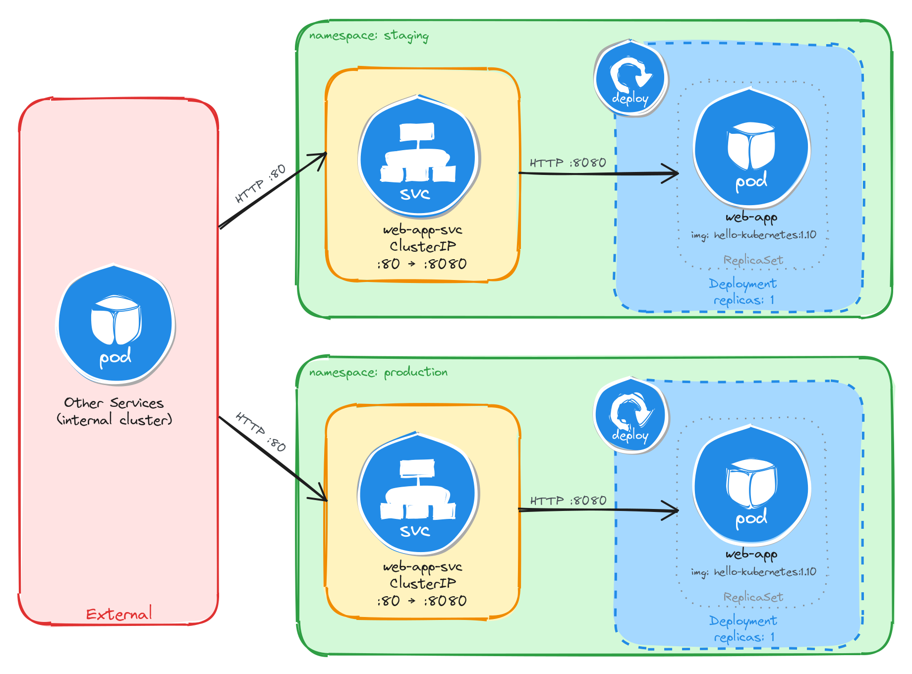

# Namespace-isolated deployment

Design and deploy the same application with its internal Service into separate Namespaces to simulate staging and production environments.

This category includes the following learning objectives:
- Understanding of Pods.
- Understanding of Deployments.
- Understanding of ClusterIP Services.
- Understanding of Namespace isolation, resource scoping, and deploying objects into specific Namespaces.

## Task 1: Design and deploy a web application in staging and production namespaces

Your team needs to run the same internal web application in two isolated environments: `staging` and `production`. Each environment must be fully self-contained, with its own Deployment and Service, so that changes in one environment cannot affect the other.

The web application must run as a [hello-kubernetes](https://hub.docker.com/r/paulbouwer/hello-kubernetes) container, which displays the namespace it is running in, making it easy to confirm namespace isolation visually. It does not need to be highly resilient, since brief periods of unavailability are acceptable.

Other services within each namespace need a stable address to reach the web application, but it must not be accessible from outside the cluster.

### Architectural design

The task requires running the same application in two isolated environments, brief downtime is acceptable, and the application must be reachable only from inside each namespace. These constraints drive four design decisions:

1. Two separate Namespaces (`staging` and `production`) provide the isolation boundary. Every Kubernetes resource is scoped to a Namespace, so Deployments, Pods, and Services created in one Namespace are invisible to the other. This lets both environments share the same resource names without conflict.

2. Because the application is a single container and brief downtime is acceptable, a Deployment with one replica per Namespace is enough. Each Deployment creates its own ReplicaSet, which recreates the Pod automatically if it crashes, at the cost of a short period of unavailability that the task explicitly allows.

3. Other services within each Namespace need a stable address to reach the web application. Pod IPs change every time a Pod is recreated, so we place a ClusterIP Service (`web-app-svc`) in front of the Pod in each Namespace. The Service provides a fixed cluster-internal DNS name and forwards traffic to the Pod. It accepts requests on port `80` and forwards them to the container's port `8080`.

4. The application must not be accessible from outside the cluster. A ClusterIP Service has no external port and no route from outside the cluster network, so it satisfies this requirement by design. No Gateway, Ingress, or NodePort is needed.



The diagram shows the resulting architecture: the `staging` and `production` Namespaces each contain an independent Deployment and ClusterIP Service with the same names. External clients have no path into either environment, while internal services reach the web application through the ClusterIP Service in their own Namespace. Cross-namespace access is possible only via the fully qualified DNS name (`web-app-svc.<namespace>.svc.cluster.local`), since short Service names resolve only within the same Namespace.

### Implementation

We start by creating the two namespaces:

```bash
kubectl create namespace staging
kubectl create namespace production
```

Next, we create a file called `web-app.yaml` that will be reused for both environments:

```bash
cat <<EOF > web-app.yaml
```

With the following content:

```yaml
apiVersion: apps/v1
kind: Deployment
metadata:
  name: web-app
  labels:
    app: web-app
spec:
  replicas: 1
  selector:
    matchLabels:
      app: web-app
  template:
    metadata:
      labels:
        app: web-app
    spec:
      containers:
        - name: hello-kubernetes
          image: paulbouwer/hello-kubernetes:1.10
          ports:
            - containerPort: 8080
          env:
            - name: KUBERNETES_NAMESPACE
              valueFrom:
                fieldRef:
                  fieldPath: metadata.namespace
EOF
```

The `KUBERNETES_NAMESPACE` environment variable is injected using the downward API, which allows a container to read its own Pod metadata at runtime. The `hello-kubernetes` application uses this variable to display the namespace in its response.

Notice that the manifest does not include a `namespace` field in the metadata. We will supply the target namespace at apply time using the `-n` flag, which lets us reuse the same manifest for both environments.

To verify the file was created correctly, run:

```bash
cat web-app.yaml
```

Apply the manifest to both namespaces:

```bash
kubectl apply -f web-app.yaml -n staging
kubectl apply -f web-app.yaml -n production
```

Next, we expose each Deployment as a ClusterIP Service inside its respective namespace:

```bash
kubectl expose deployment web-app \
    -n staging \
    --name=web-app-svc \
    --type=ClusterIP \
    --port=80 \
    --target-port=8080
```

```bash
kubectl expose deployment web-app \
    -n production \
    --name=web-app-svc \
    --type=ClusterIP \
    --port=80 \
    --target-port=8080
```

#### Verify resource creation

To verify that the Pods are running in each namespace, execute the following commands:

```bash
kubectl get pods -n staging -l app=web-app
kubectl get pods -n production -l app=web-app
```

The output for each should look similar to this:

```bash
NAME                          READY   STATUS    RESTARTS   AGE
web-app-6bfbf8b67c-m4t9x      1/1     Running   0          1m
```

To verify that the Services are configured correctly in each namespace, run:

```bash
kubectl get svc -n staging web-app-svc
kubectl get svc -n production web-app-svc
```

The output for each should look similar to this:

```bash
NAME             TYPE        CLUSTER-IP      EXTERNAL-IP   PORT(S)   AGE
web-app-svc      ClusterIP   10.96.112.54    <none>        80/TCP    1m
```

Note that the two Services share the same name (`web-app-svc`) but have different Cluster IPs, because they are independent resources in separate namespaces.

#### Test the web application

To test the staging web application, create a temporary Pod inside the `staging` namespace and send a request through the Service:

```bash
kubectl run -it --rm --restart=Never busybox \
    --image=busybox \
    -n staging \
    -- sh
```

Inside the busybox Pod, use `wget` to access the web application through the Service:

```bash
wget -qO- http://web-app-svc
```

The response should be the hello-kubernetes HTML page showing the namespace the Pod is running in:

```html
<!DOCTYPE html>
<html>
<head>
    <title>Hello Kubernetes!</title>
    <!-- CSS styles omitted for brevity -->
</head>
<body>
  <div class="main">
    <!-- Content omitted for brevity -->
    <div class="content">
      <div id="message">Hello world!</div>
      <div id="info">
        <table>
          <tr>
            <th>namespace:</th>
            <td>staging</td>
          </tr>
          <tr>
            <th>pod:</th>
            <td>web-app-67d9bd9d5d-n5t7g</td>
          </tr>
          <tr>
            <th>node:</th>
            <td>- (Linux 6.8.0-101-generic)</td>
          </tr>
        </table>
      </div>
    </div>
  </div>
</body>
</html>
```

To confirm that the response contains the correct namespace, run:

```bash
wget -qO- http://web-app-svc | grep -A1 'namespace'
```

The output should show the `staging` namespace:

```html
<th>namespace:</th>
<td>staging</td>
```

Repeat the same test for the `production` namespace by running the busybox Pod with `-n production`. The grep output should show `production` instead of `staging`, confirming that each Deployment is running in its own isolated namespace.

#### Verify namespace isolation

To confirm that the short Service name does not resolve across namespaces, create a temporary Pod in the default namespace:

```bash
kubectl run -it --rm --restart=Never busybox --image=busybox -- sh
```

Inside this Pod, attempt to reach the staging web application using its short service name:

```bash
wget -qO- --timeout=5 http://web-app-svc
```

This fails because short Service names only resolve within the same namespace. Services in other namespaces are reachable using their fully qualified DNS name (`<service>.<namespace>.svc.cluster.local`):

```bash
wget -qO- http://web-app-svc.staging.svc.cluster.local
```

This request succeeds, demonstrating that Kubernetes namespaces scope resource visibility and RBAC, but do not enforce network-level isolation on their own. To restrict cross-namespace traffic, NetworkPolicies must be used in addition to namespaces.

The same can be done to access the production web application:

```bash
wget -qO- http://web-app-svc.production.svc.cluster.local
```
